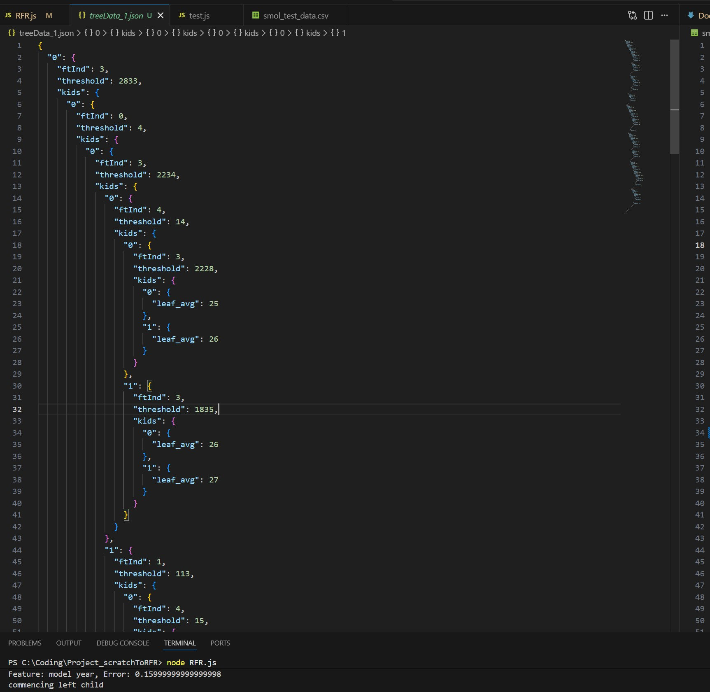

# scratchToRFR

Welcome! In this new project I'm embarking on, we'll be creating a Random Forest Regressor from scratch using Javascript.

Lets lay out the roadmap, don't worry its not that long:

### Chapter 1: Data
- 1.1: [Bootstrapping rows from scratch](#11-bootstrapping-rows-from-scratch)
- 1.2: [Feature Bagging](#12-feature-bagging)

### Chapter 2: Tree Model
- 2.1: [Node Object](#21-node-object)
- 2.2: [Tree Object](#22-tree-object)
- 2.3: [Tree Prediction](#23-tree-prediction)

### Chapter 3: Forest Management
- 3.1: [n_estimators = n trees](#31-n_estimators--n-trees)
- 3.2: [Forest Prediction](#32-forest-prediction)

### Chapter 4: [Conclusion](#conclusion)

### Bonus Chapter: Model Optimization (cmg soon!)
- B1: [Single-use Features](#b1-single-use-features)
- B2: [Criterion: MAE](#b2-criterion-mae)


## 📚 Documentation

## Chapter 1 - Data

### 1.1: Bootstrapping Rows from scratch

Random Forest Regressor models bootstrap their data samples before passing them on to their trees. What this means is that only a random percentage of the entire dataset is passed to each tree. Since bootstrap does not exclude rows after they are chosen, duplicate rows can appear within the subset of data as well.

Not to worry though, this is an intended effect and does not induce overfitting. The whole point is to train each tree to be different from each other. Without repeated rows, each tree is getting the same data, just reshuffled and with a small fraction removed.

To do that, we randomly sample from the training dataset with replacement, until the sample dataset has as many rows as the training dataset. This will go to the first tree. Then we do this again for the subsequent trees.

First, we have to extract the information from the data csv. Here, I use a sample csv from another project, just to demonstrate what we will be doing to the actual training data csv.

```
const fs = require("fs");

const unclean_csv = fs.readFileSync("../Project-JBridge/final_data_tillratings7.csv", "utf8");
const csv = unclean_csv.replace(/\r/g, "");
```

We need fs, which is used most of the time when working with other files in the local device. We read it, then remove the '\r' text, which is added at the end of all csv lines (before the '\n' newline text).

As you can see, the process of reading csv files is very different compared to python. In python, courtesy of pandas, we can neatly convert the csv into a pandas dataframe a few simple and short commands. 

Unfortunately, pandas is exclusive to python only, and Javascript's pandas alternatives are a pain to download. So we will just be manually reading them as strings, before parsing them in the next part.


```
let rows = csv.split("\n")
rows = rows.map(line => line.split(','))
const colArr = rows.shift().split(',')
const len_trng_data = rows.length
const bootstrap_rows = (trngRows=rows) => {
    let tree_data = []
    for (let i = 0; i < len_trng_data; i ++) {
        let ran_int = Math.floor(Math.random(len_trng_data))
        tree_data.push(trngRows[ran_int].split(','))
    }
    console.log(tree_data.length, len_trng_data) // will remove during production
    console.log(tree_data[0]) // will remove during production
    return tree_data
}
```
We split the csv by the '\n' newline text to get each line of data. One line represents a row. Before carrying on, we remove the first row, which are the column names.

We define the length of the training dataset as `len_trng_data`. Then, using Math.random(), we get a random integer between 0 and 'len_trng_data' to pick out a row from the training dataset, before adding it to the tree's dataset. 

We do this until tree_data.length === len_trng_data, lets see if they are the same. While we are at it, we can check out the first row of data too.

```
751 751
[
  '0.0',                 '0.0',
  '1.0',                 '0.0',
  '0.0',                 '0.0',
  '1.0',                 '0.2588190451025207',
  '0.9659258262890684',  '11',
  '20',                  '3',
  '-0.7907757369376986', '-0.6121059825476627',
  '325',                 '0.3375228995941133',
  '0.9413173175128472',  '2024-11-20',
  'False',               'False',
  '0.0',                 '0.0'
]
```
Looks good, the lengths are the same and the row has all 22 column values. This code is encapsulated in the function `bootstrap_rows`, which we will be using many times to pass bootstrapped data to Tree instances.

Thats the data rows sorted, now for the columns

### 1.2: Feature Bagging
Random Forest Regressor models do what is called 'bagging' to the features to prevent overfitting. Basically, every node in a tree only gets sqrt(n) number of features, where 'n' is the total number of features. 

So if we have 20 features, each split point (node) gets sqrt(20) ~= 4 features. This allows each tree to be truly unique from each other, making for a more robust forest.

The features are sampled without replacement within the nodes, but with replacement for a new node. So every feature has an equal chance of being chosen for a node, regardless whether they appeared in a previous node or not.

```
// supply for each node
// after removing the y_columns from 'colArr'
const feature_bagging = (col_names=colArr) => {
    const node_ft_no = Math.floor(Math.sqrt(col_names.length))
    let col_names_node = col_names.slice()
    const node_cols = []
    for (let i = 0; i < node_ft_no; i++) {
        ind = Math.floor(Math.random() * (col_names_node.length-1))
        chosen = col_names_node.splice(ind, 1)
        node_cols.push(chosen)
    }
    return node_cols
}
```

First we obtain sqrt(n) in line 1, then create a copy of the feature array using slice(). This is because we are sampling without replacement for each node, so we need to remove the options once they are picked without touching the original.

Afterwards, we generate a random number within the length of the feature array copy 'ind'. Then, in one line of code, remove that index from the feature array copy and define the removed feature using `splice(ind, 1)` as 'chosen', before adding 'chosen' to the node_cols array.

Again, we will have to use a for loop to do this for every node of every tree, so thats a nested for loop. Perhaps I should have considered the toil this would take on my laptop, especially since we might be running many trees and even more rows of data.

## Chapter 2 - Tree Model

### 2.1: Node Object
Fresh out of learning OOP in Python, I want to apply the concept in this project. But do pardon me if I make any mistakes, its my first time applying classes and objects to a project.

I think treating the heavily repeated nodes and trees like objects, with built-in properties and methods, will save us a lot of time and codespace.

Lets refresh ourselves on what nodes are. They are the points in the decision tree that split the **data rows** it receives into 2 groups based on the  **threshold value** of a feature, out of the **sqrt(n) features** in the node.

The threshold value of each feature is chosen based on how low the `weighted variance` is.

With that in mind, lets create the `Node` class, starting with its attributes.

```
class Node {
    constructor(input_rows, features) {
        this.input_rows = input_rows
        this.ftError = {}
        this.ftThres = {}
        for (const feat of features) {
            this.ftError[feat] = Infinity
            this.ftThres[feat] = undefined
        }
        this.bestFt = undefined
    }
```

First, I define the 2 arguments that will go into a node object (input training rows & chosen features). Then, I create a dictionary (or hashmap I think its called outside of python) with the chosen feature names as its keys. 

The dictionary is called `ftError`, as it is meant to assign the feature name to its best variance score of all it's thresholds. The variance scores are set to Infinity temporarily.

`ftThres`, short for 'feature threshold', stores the best threshold value for each feature. Again, because they have not been calculated, the values in the key-value pairs are set to 'undefined'. For now.

`bestFt`, short for feature index, will be assigned the feature with the lowest variance score inside ftError, paired with its corresponding threshold value from ftThres. This will be calculated later on, so it is set to undefined for now.

Lets move on to the methods.

```
    calcAvg = (arr) => {
        let sum = arr.reduce((accum, cur) => accum + Number(cur), 0)
        let avg = sum/arr.length
        return avg
    } 
```

`calcAvg` is nothing special, just a little method which calculates the mean of an array of numbers. If I was using python, I would not bother since I would be using pandas, and pandas has a built in method for calculating average.

Edit: I moved calcAvg outside the class to make it a global function afterwards, below `feature_bagging`. I have a feeling it will be used outside of nodes as well.

```
    calcVar = (grp1, grp2) => {
        let grps = [grp1, grp2]
        let means = [this.calcAvg(grp1), this.calcAvg(grp2)]
        let vars = [0, 0]

        for (let i = 0; i < grps.length; i++) {
            let grp = grps[i]
            for (const y of grp) {
                let ting = (y-means[i])**2
                vars[i] += ting
            }
        }
        let div = grp1.length + grp2.length 
        return (vars[0] + vars[1])/div
    }
```

As mentioned earlier on what goes on in a **tree node**, a split is determined by the best **weighted variance** value. The feature threshold with the lowest of that value is picked to be the splitting factor for that node.

`calcVar` calculates the weighted variance for each threshold. The 2 arguments it accepts, grp1 and grp2, are arrays of y_column values. The 'grp1' array consists of y_column values below the threshold, while 'grp2' holds those above.

I won't bore you too much with the code within, its just the mean squared error (MSE) formula in Javascript syntax with some extra stuff on top to apply weightage. But I will point out the use of calcAvg in the 3rd line of the method. Adding the mean formula in the list would make the code quite an eyesore.


```
    pickBest = () => {
        let smol = Infinity
        let ind = undefined
        for (const ft in this.ftError) {
            if (this.ftError[ft] < smol) {
                smol = this.ftError[ft]
                ind = ft
            } 
        }
        this.bestFt = [ind, this.ftThres[ind]]
    }
```

`pickBest` iterates through the variance scores in 'ftError' and singles out the lowest value, as well as its feature key. Then it finds the threshold value responsible for that variance score from ftThres, then assigns both the feature name and threshold value to `bestFt` as a key value pair.


```
code for JSONsave
```

`JSONsave` ...

```
    testThres = (croppedData, binary=false) => {
        console.log(croppedData.slice(0, 5))
        let lowest = Infinity
        let thres_val = undefined
        let x_vals = croppedData.map(row => row[0])
        let unique_x = new Set(x_vals)
        if (binary === false) {
            for (const i of unique_x) {
                    let left = croppedData.filter(row => Number(row[0]) <= Number(i))
                    // console.log(left.length)
                    // console.log(left)
                    let right = croppedData.filter(row => Number(row[0]) > Number(i))
                    left = left.map(row => row[1])
                    right = right.map(row => row[1])
                    // console.log(right.length)
                    // console.log(right)
                    let pot = this.calcVar(left, right)
                    // console.log(pot)
                    if (pot < lowest) {
                        lowest = pot
                        thres_val = i
                    }
            }
        } else {
            let falses = x_vals.filter(x => x === false)
            croppedData.sort((a, b) => a[0] - b[0])
            let y_vals = croppedData.map(row => row[1])
            let left = y_vals.slice(0, falses.length)
            let right = y_vals.slice(falses.length)
            lowest = this.calcVar(left, right)           
        }
        return [lowest, thres_val]
    }
```

Getting slightly more complicated now, `testThres` tests all possible thresholds in the x_column. The 'croppedData' argument consists of just 2 columns from the input data: The target x_column, and the y_column.

The 'binary' argument tells us if the target column contains numerical or binary values. Its set to false by default as we usually encounter more numerical columns than binary, in my experience anyway. The method handles binary columns differently to numerical columns, as you will see in a second.

For each possible threshold, I split the y values into 2 groups based on which side of the threshold its x value lies, then calculate their combined weighted variance (the error metric basically). I find the lowest variance I can obtain and store it in 'lowest', along with its corresponding threshold value in 'thres_val'.

That was for numerical columns. For binary columns its easier as we don't have to loop through a bunch of thresholds, just the 1: true vs false. So the y values are split into 2 groups based on whether the x values are true or false.

Afterwards, I simply return the lowest error obtained and the threshold value that obtained it.

EDIT: I changed testThres such that instead of looping through unique values in the column, I looped through the **midpoints** of those unique values.

To do this, I simply squeezed abit of code inside, *before* comparing the row values with the threshold and *after* declaring the 'unique_x' set.

```
        let unique_x = new Set(x_vals)
        unique_x = [...unique_x]
        let unique_thres = new Set()
        for (let i = 1; i < unique_x.length; i++) {
            let x = unique_x[i-1]
            let y = unique_x[i]
            let thres = (x+y)/2
            unique_thres.add(thres)
        }
        // MAKE CHANGE HERE, UNIQ_THRES N ADD ALL IN BTW VALUES FRM UNIQUE_X
```

I converted unique_x into a list of a set so that I could index into it with a for loop. Then I took the midpoints between all adjacent values in unique_x and appended them to unique_thres.

This is how the default RFR model in scikit-learn operates, so I should probably follow suit. And we can always try out both ways during testing to see which produces more accurate results. The traditional method will probably do better, but we'll see.

```
    loopFts = () => {
        // console.log(this.input_rows.slice(0, 4))
        for (const ft in this.ftError) {
            console.log(ft)
            let ftInd = colArr.indexOf(ft)
            let cropData = this.input_rows.map(rows => [rows[ftInd], rows[rows.length-1]])
            let binary = false
            console.log(cropData.slice(0, 4))
            if (typeof cropData[0][0] === 'boolean') {
                binary = true
            }
            let resArr = this.testThres(cropData, binary)
            // console.log(resArr)
            this.ftError[ft] = resArr[0]
            this.ftThres[ft] = resArr[1]
        }
    }

```

`loopFts` is the method that is supposed to come before testThres. testThres obtains the optimal threshold for individual columns, while loopFts tells it which x_column to examine. 

You can see in the first line, it loops through the keys of ftError, which contains all the sqrt(n) feature names. Then, it takes only the y_columns and target x_column before creating a new data list out of those 2 columns, cropData.

It checks if the x_column values are binary or numerical before passing them into testThres. Afterwards, it stores the returned values in their rightful places: The optimal variance error goes into ftError, while the threshold goes into ftThres. They are stored as values, with their keys being the feature name 'ft'.

```
    passOn = () => {
        let chosenFeat = this.bestFt[0]
        let chosenFeatInd = colArr.indexOf(chosenFeat)
        let leftData = undefined
        let rightData = undefined
        let threshold = this.bestFt[1]
        if (threshold !== undefined) {
            leftData = this.input_rows.filter(x => x[chosenFeatInd] <= threshold)
            rightData = this.input_rows.filter(x => x[chosenFeatInd] > threshold)
        } else {
            leftData = this.input_rows.filter(x => x[chosenFeatInd] === true)
            rightData = this.input_rows.filter(x => x[chosenFeatInd] === false)
        }
        // output the Node's experiences b4 moving on to new nodes
        // would be boring if we did'nt get to see how the other features fared.
        console.log('Features and their losses for this node. Errors are weighted variances')
        for (const ft in this.ftError) {
            console.log(`Feature: ${ft}, Error: ${this.ftError[ft]}`)
        }
        // new nodes will continue what we started o7
        // const node1 = new Node(leftData, feature_bagging())
        // const node2 = new Node(rightData, feature_bagging())
        return [leftData, rightData]
    }
```

The final method of the Node class (for now), `passOn`, filters the data based on the optimal threshold picked out by 'pickBest' into 2 groups. I then return the 2 groups as arrays for 2 new Node instances to take in.

But before that, the method logs the best variance values of all the features passed to the node, to show the user how well the rest of the features did with their optimal thresholds.

Lets test if the class and it's methods work by putting it in action. I'll be using the first 50 rows of a simple house price dataset I got from Kaggle.

```
const unclean_csv = fs.readFileSync("smol_test_data.csv", "utf8");
...
let testNode = new Node(bootstrap_rows(), feature_bagging())
// console.log(testNode)
testNode.loopFts()
testNode.pickBest()
console.log(testNode)
console.log(testNode.passOn())
```

Output:

```
Node {
  calcVar: [Function: calcVar],
  pickBest: [Function: pickBest],
  JSONsave: [Function: JSONsave],
  testThres: [Function: testThres],
  loopFts: [Function: loopFts],
  passOn: [Function: passOn],
  input_rows: [
    [ '33.542039', '73.093414', '5', '5', '20.0', '11' ],
    [ '33.698137', '72.978215', '3', '3', '5.3', '630' ],
    [ '33.602038', '73.141966', '4', '4', '4.0', '680' ],
    [ '33.594496', '72.92659499999999', '5', '6', '8.0', '1250' ],
...
    [ '33.694495', '72.82665300000001', '6', '6', '20.0', '2690' ],
    [ '33.508481', '73.091826', '3', '3', '10.0', '1900' ],
    [ '33.737402', '73.179159', '2', '2', '5.0', '1' ]
  ],
  ftError: { latitude: 35732827.86403327, bedrooms: 16200855.453877551 },
  ftThres: { latitude: 33.724018, bedrooms: 0 },
  bestFt: [ 'bedrooms', 0 ]
}
Features and their losses for this node. Errors are weighted variances
Feature: latitude, Error: 35732827.86403327
Feature: bedrooms, Error: 16200855.453877551
[
  [ [ 33.731531596441, 73.065696358681, 0, 0, 90, 40000 ] ],
  [
    [ 33.541728000000006, 73.094103, 7, 7, 40, 8000 ],
    [ 33.698065, 73.044612, 2, 2, 9.3, 6 ],
    [ 33.737402, 73.179159, 3, 3, 5, 450 ],
...
```
Looks ok so far, everything is in its rightful place and no NaN values in sight. The error values (35732827, 16200855) may look alarming, but thats just how MSE is, they are bloody big.

Its better to compare with the MSE of the entire [dataset](smol_test_data.csv), which is slightly under 65 million au. Compared to that, 36 mil and 16 mil suddenly dont seem so large.

That wraps up chapter 2.1 for now, man what a subchapter. Never in my life have I wrote so much class code in one sitting.
Definitely one of the more satisfying coding sessions I've had. 

### 2.2: Tree Object

Each tree object will not only manage many node instances, but it will also contain the hyperparameter value for 'min_samples_leaf'.

I know 'max_depth' is also a hyperparameter which we tuned in [Johorscrape](https://github.com/milkbottledude/woodlands-jb_tracker/blob/master/Documentation.md#45-hyperparameter-tuning-tbc), but its purpose is similar to min_samples_leaf, which is to limit tree growth for fear of overfitting. 

As for 'n_features', I forgot to consider it when creating the node class. If specified in the tree instance, it should be used over sqrt(n), so I've edited the `feature_bagging` function slightly to accomodate this.

```
const feature_bagging = (col_names=colArr, n_fts=undefined) => {
    let node_ft_no = n_fts
    if (!node_ft_no) {
        node_ft_no = Math.floor(Math.sqrt(col_names.length))
    }
    let col_names_node = col_names.slice()

    ...

    return node_cols
}
```
Just the small change of adding 'n_fts' as an optional argument.

Regarding 'criterion', I think its a valid hyperparameter that ought to be in this model. Being able to see avg MAE per threshold might make it easier to understand the loss metric, as MSE can put things quite out of perspective with their massive loss values due to the squaring.

Its a hyperparam that is involved in data splitting at node level, so it should be in the node class not tree class. If time permits, I'll go back and add it in chapter 2.1. (cmg sooon!)

I won't be including the 'bootstrap' hyperparameter, as an RFR model without bootstrapped data is just many decision trees. They all get the same dataset, which defeats the point of the RFR.

'n_estimators' is a hyperparameter that will be defined one level higher than the tree, the forest object, so we won't be using it here.

Lets start with defining the tree class properties, before moving on to the methods.

```
class Tree {
    constructor(all_rows, min_samp_leaf=1) {
        this.btstr_rows = bootstrap_rows(all_rows)
        this.min_samp_leaf = min_samp_leaf
        this.no = 0
        // this.nodes = new Map()
        this.JSONdata = {}
        this.leaves = [] // remove in production 
    }
```

The `Tree` class takes in 2 args: 'all_rows' = the entire dataset excluding the first row of column names, and 'min_samp_leaf', the minimum number of samples a node must have for it to be considered a leaf and stop splitting.

'this.no' tracks the number of node instances created in this tree, while ~~'this.nodes'~~ 'this.JSONdata' will track the nodes that grow within the tree. The 'this.JSONdata' structure will be akin to a tree branching out from the root. It's rather confusing, so heres a concept diagram I drew of it.

***INSERT HAND DRAWN FIG HERE***

Fig 2.1: Concept diagram of ~~this.nodes~~ this.JSONdata map

***explain hand drawn fig***

Now lets move on to the main method of the Tree class, the recursive function that will keep making and splitting nodes until the min_samp_leaf value is reached: `recur_node`.

```
    recur_node = (node_rows=this.btstr_rows, cur=this.nodes) => {
        if (node_rows.length <= this.min_samp_leaf) {
            console.log('min_samp_leaf fulfilled, ending node')
            return 
        }
        const node = new Node(node_rows, feature_bagging())
        this.no++
        node.loopFts()
        node.pickBest()
        let [left, right] = node.passOn()
        cur.set(node, new Map())
        cur = cur.get(node)
        // checking if left and right are already pure
        let uniq_left =  new Set()
        for (const row of left) {
            uniq_left.add(row[1])
        }
        let uniq_right = new Set()
        for (const row of right) {
            uniq_right.add(row[1])
        }
        if (uniq_left.size > 1) {
            console.log('commencing left child')
            this.recur_node(left, cur)
        }
        if (uniq_right.size > 1) {
            console.log('commencing right child')
            this.recur_node(right, cur)
        }
    }
```

First we create a new node instance and pass it the rows. If its the root node, we pass it this.btrstr_rows. If its a child node, we pass it either the leftData or rightData, as you can see in the last 2 lines.

The second argument, 'cur', is quite out of the box and will need some explanation. Its the tree level at which the current node is at. So at the start, when calling `recur_node` for the root node, I will pass in this.nodes as 'cur'.

Within recur_node, I'll set a key-value pair inside cur, with the root node being the key and an empty map being the value. Then, I'll change cur to 'this.nodes[rootNode]', which is the new empty map we just set as the value.

Then, inside this new map, we will add 2 new nodes. This is from calling this.recur_node two more times, on the left and right side of the data. Notice how this time, the 'cur' passed to these 2 child nodes is not the cur passed to the root node, its the value in the key-value pair of the previous 'cur'.

The recursion of node creation and node splitting will continue until the 'min_samp_leaf' criteria is met, or if the variance of all the node rows are already zero.

To check if there is zero variance and the node's dataset is already pure, we can loop through the dataset and append the values to a set. If the set's length > 1, that means the dataset is not pure, and we can continue with `recur_node`.

That should be it for the Tree class (for now), lets test it out and see if we can find any bugs. I will probably find many, but I won't them to you haha.

```
let testTree = new Tree(rows, 2)
testTree.recur_node()
console.log(testTree)
```

After many bug fixes, heres the correct output:

```
...
Feature: Area_in_Marla, Error: 38427222.22222222
Feature: baths, Error: 0
Tree {
  recur_node: [Function: recur_node],
  btstr_rows: [
    [ 31.499348, 74.41695899999999, 0, 3, 9, 950 ],
    [ 33.575405, 73.143325, 5, 3, 24, 5 ],
    [ 33.679210999999995, 72.988787, 5, 5, 20, 4000 ],

...

    [ 33.728873, 73.119628, 3, 3, 7.1, 3500 ],
    [ 33.623946999999994, 73.126588, 8, 8, 32, 3450 ]
  ],
  min_samp_leaf: 2,
  no: 26,
  nodes: Map(1) {
    Node {
      calcVar: [Function: calcVar],
      pickBest: [Function: pickBest],
      JSONsave: [Function: JSONsave],
      testThres: [Function: testThres],
      loopFts: [Function: loopFts],
      passOn: [Function: passOn],
      input_rows: [Array],
      ftError: [Object],
      ftThres: [Object],
      bestFt: [Array]
    } => Map(2) { [Node] => [Map], [Node] => [Map] }
  }
}
```

Looks good, the most important thing here is the value of 'this.no'. The fact that its = 26 is good, because that means the recursion worked and 26 nodes were created. This is impossible to tell from printing nodes, as console.log doesn't print out the full structure.

One thing I realized is that I forgot to create a function to store the leaf data. The most valuable part of the Tree class, and it completely slipped my mind. Sometimes I wonder if my iq is enough to make a career out of this.

After a day of brainstorming, I've decided to scrap this.nodes for this.JSONdata. They are both similar in that they will both store nested node data, but JSONdata won't store the actual class instances, just the relevant data needed for prediction.

While this.nodes stores the whole object as the key, I will only save:

1) insertion order index (key)
2) feature index (key inside val, which is a nested dict)
3) threshold value (key inside nested dict val)

To save the feature index, I have edited the `passOn` method inside the Node class, making it return not just the left and right side data, but also the index value of the column feature name as well as the optimal feature threshold value:

```
...
        return [leftData, rightData, chosenFeatInd, threshold]
```
Now lets edit the recur_node method. I'll split it into parts so its easier to understand.

```
    recur_node = (node_rows=this.btstr_rows, cur=this.JSONdata) => {
...
        node.pickBest()
        let [left, right, featInd, thres_val] = node.passOn()
        if (Object.keys(cur).length === 0) {
            cur[0] = {'ftInd': featInd, 'threshold': thres_val, 'kids': {}}
            cur = cur[0]['kids']
        } else {
            cur[1] = {'ftInd': featInd, 'threshold': thres_val, 'kids': {}}
            cur = cur[1]['kids']
        }
...
```
After retrieving the 4 results from node.passOn(), I add the feature index (featInd) and feature threshold (thres_val) to 'cur' as values of a nested dict. The third key in the dict value, 'kids', is for the 2 child nodes (which will receive 'left' and 'right' as their node_rows argument).

As for why I set the dicts as values and set the keys as 0 and 1, this is for when we save the JSONdata and want to access it for prediction in the future. We need to know which cur[x] is left or right. So 0 represents left, and 1 represents. 

I apologise if my explanations are too incoherent, it might not look like it to you but I still consider myself a newbie in the world of machine learning. If you're open for face-to-face discussions, hit me up on telegram :). We could grab a coffee, and maybe become friends.
```
...
        let uniq_left =  new Set()
        let leftY = []
        for (const row of left) {
            uniq_left.add(row[1])
            leftY.push(row[1])
        }
        let uniq_right = new Set()
...
```
Here, I'm just creating:
1) a set, to keep track of unique values. If the set length <= 1, that means 'left' is pure and does not need to be split further.
2) a list, to pass the single column of y_values into calcAvg() should the next child node be a leaf node. I knew making the calcAvg() function global would come in handy.

I do the same for the 'right' later on.

```
...
        if (uniq_left.size > 1 && leftY.length > this.min_samp_leaf) {
            console.log('commencing left child')
            this.recur_node(left, cur)
        } else {
            console.log('stop criteria met, ending node')
            cur[0] = {'leaf_avg': calcAvg(leftY)}
            this.leaves.push(cur[0]) // remove in production
        }
        if (uniq_right.size > 1 || rightY.length <= this.min_samp_leaf) {
...
```
First, I check if the 2 stopping criteria have been met. If no, then I call the recursive function 'recur_node' to create more node offsprings. 

If yes, then we log the average y_val in the leaf and store it in cur[0], not cur[1] cuz this is the left side. 'this.leaves' is just to make sure the output is valid, its not important to the class infrastructure. 

I just console.log it to make sure everythings running ok, which we will realise is a good idea soon when I show you the output logs.

```
let testTree = new Tree(rows, 2)
testTree.recur_node()
console.log(testTree.no)
console.log(testTree.leaves)

Output: 
...
30
[
  562.5, 22000, 40000,   NaN,   NaN,
    800,   500,   780,   690,     6,
     17,    18,    20,   680,   450,
   2825,  1250,    11,  32.5,  1025,
   4175,    27,  5000,  5500,  8000,
   3075, 10000,  4700, 23000, 22000,
   8850
]
```

Looks ok, the values are far apart from each other. Earlier, I had mistakenly singled out row[1] for the y_column when it was actually row[row.length-1], resulting in the list above having longitude values instead of house prices.

If you have a sharp eye, you would have noticed the NaN values. That happens when feature the node is trying to split on has only one unique value in all the input rows. For eg, it just so happens that all the rows fed to a particular node have bedroom number = 1, and the node chose no. of bedrooms as one of its sqrt(n) features.

While it does not pose a problem at the moment, it will when we do prediction and the test row happens to have, for example bedroom number = 0. It will encounter a leaf node with mean value = NaN. 

Fret not, for I have a simple but rather brute fix for this, which I'll show it to you in a second as we transition into our next chapter. 

So far, we have been focusing on training the model. In this next chapter, we will be focusing on the prediction aspect of the Tree class.

### 2.3: Tree Prediction

In order to do prediction, we will need the data from the Tree object's this.JSONdata. It contains all the feature indexes and thresholds for the node splits. Naturally, that means we need a method to export the JSONdata object into a JSON file.

Originally, I had planned for the 'toJSON' function to be a method inside the Tree class, but decided to make it a global function for the forest manager to call instead. This makes more sense as then we would only need to call it once and not x times, where x is the number of trees in the forest.

```
let filePath = 'rfrData_1.json'

const toJSON = (dictData, filepath=filePath) => {
    fs.writeFileSync(filepath, JSON.stringify(dictData, null, 2));
    console.log("dict to JSON complete");
}
```

Now we need a function to retrieve that stored data, I'll call it 'fromJSON'

```
const fromJSON = (filepath=filePath) => {
    const raw = fs.readFileSync(filepath);
    const dict = JSON.parse(raw);
    return dict
}
```

I made it so that the data saving and data retrieval process is as hassle free as possible, placing default args wherever I can.

Now lets get on with the prediction, starting with saving our tree data. As we are saving **tree** data not forest data, I'll be changing the filepath argument when calling toJSON(). 

Also, forgot to mention that I'll be using the ['miles per galon of a car' dataset](smol_pt2.) from now on. Its 'mpg' y column has less deviations than the [house prices dataset](smol_test_data.csv)

```
let testTree = new Tree(rows)
testTree.recur_node()
console.log(testTree.JSONdata)
toJSON(testTree.JSONdata, 'treeData_1.json')
```

The console.log(testTree.JSONdata) would not show the entire nested structure of the object, but after saving it to a [JSON file](treeData_1.json) we can now see it in its full glory.



Fig 2.2: Sneak peek at the nested objects

As we can see from the top right, the rough tree structure is there. Looking more in depth on the first few nodes, we can see the left side reach leaf nodes at depth = 5, which I think is a good number for a dataset as small as this (50 rows). 

Looks pretty similar to Fig 2.1 right? I also made a [second JSON](treeData_2.json) for another Tree instance's data after I changed the testThres() method in the Node class, which uses midpoint values as thresholds instead of the actual unique values.

Now that we have the trained model data saved, we no longer have to train the model everytime we want to use it. Instead, we can call fromJSON() and start predicting from there. Lets see if fromJSON() works as expected.

```
console.log(fromJSON('treeData_1.json'))
```

Output:

```
{
  ftInd: 3,
  threshold: 2833,
  kids: {
    '0': { ftInd: 0, threshold: 4, kids: [Object] },
    '1': { ftInd: 2, threshold: 130, kids: [Object] }
  }
}
```

Looks good, the root node's threshold value is the same as that in Fig 2.2, and the nested objects are there, even if console.log does not print them out fully. Now we can start making the prediction method inside the Tree class.


```
const predictRow = (testRow, dataDict, num=0) => {
    let subDict = dataDict[num]
    if ('leaf_avg' in subDict) {
        if (subDict['leaf_avg'] === null) {
            if (num == 0) {
                return predictRow(testRow, dataDict, 1)
            } else {
                return predictRow(testRow, dataDict, 0)
            }
        } else {
            return subDict['leaf_avg']
        }
    } else {
        let ftInd = subDict['ftInd']
        let threshold = subDict['threshold']
        if (testRow[ftInd] <= threshold) {
            return predictRow(testRow, subDict['kids'], 0)
        } else {
            return predictRow(testRow, subDict['kids'], 1)
        }
    }
}
```

`predictRow` is another recursive function, similar to 'recur_node' but for predicting instead. 

Remember that simple fix I had for when 'leaf_avg' == NaN? Its in the first 'if' statement of the function. So when the method encounters a NaN (now 'null'), it ignores that leaf and looks at the sibling node.

This aligns with how DTR and RFR models in scikit-learn operate, they ignore nodes that dont split the input data and carry on with another random sample of sqrt(n) features.

If its not that deep into the Tree yet and no leaf nodes have been encountered, we extract the threshold and feature index values from the dict, before checking if the target column's values is greater or smaller than the threshold.

If val > threshold, we traverse to the node for values greater than, which would be subDict['kids'][1]. Otherwise, we go to subDict['kids'][0]. We keep going until we reach a leaf node, and you've already seen what happens then.

Time to test. The 50 rows in [mpg dataset](smol_pt2.csv) is actually part of a much bigger dataset, which you can download from Kaggle. I'll randomly take a row from there thats not in the training data, and pass it into predictRow() for prediction.

```
let dict1 = fromJSON('treeData_1.json')
let unseenRow = [8, 318, 135, 3830, 15.2, 79]
let actualY = 18.2
let predY = predictRow(unseenRow, dict1)
console.log(actualY, predY)

Output: 18.2 9
```

OUR FIRST PREDICTION WOO! But not a great one, underestimated the actual value by 9.2mi/gal, over 50%! But this is with the data from treeData_1.json, which was obtained when the model was training with unique column values as thresholds.

Lets try treeData_2.json, which follows scikit-learn's tree models and was trained with values midpoints as the threshold values.

```
let dict2 = fromJSON('treeData_2.json')
...
let predY = predictRow(unseenRow, dict2)
console.log(actualY, predY)

Output: 18.2 23
```
Overshot, but by 4.8mi/gal, much less than before. And before you say this Tree model sucks, remember that it was only trained on 50 rows of data. Shes no neural network, but shes no linear regressor either.

Of course, we can do better. This is just a single Tree in a forest! Once we get the forest manager up and running, we can average out the predictions of multiple Tree instances, which (fingers crossed) will lead to smaller deviations from the actual value.

## Chapter 3 - Forest Management
### 3.1: n_estimators = n trees

Lets create the Forest class and define the properties first, then carry on with methods afterwards.

```
class Forest {
    constructor(n_estimators, all_rows, min_samp_leaf=1) {
        this.n_estimators = n_estimators
        this.col_row = all_rows.shift()
        this.trngRows = all_rows
        this.JSONdata = []
        this.min_samp_leaf = min_samp_leaf
    }
```
The first argument takes one of the key hyperparameters of every RFR model, 'n_estimators'. It decides how many trees we want in our forest, so naturally it should be stored in the Forest class and not the Tree or Node class.

The second argument 'all_rows' accepts the entire csv as an array of row arrays. It pops the first row, which contains all the column names, and assigns it to 'this.col_row'. The remaining rows are assigned to 'this.trngRows'. The y_column **must** be the last column.

'this.JSONdata' in the Forest class functions the same way as in the Tree class, storing the data needed for predictions. The only difference is that this one will store an array of Tree JSONdatas.

```
    trainTrees = () => {
        for (let i = 1; i <= this.n_estimators; i++) {
            let treeInst = new Tree(this.trngRows, this.col_row)
            treeInst.recur_node()
            this.JSONdata.push(treeInst.JSONdata)
        }
    }
```
`trainTrees` is basically just calling recur_node n-times, where n = number of trees, n_estimators. Instead of immediately exporting as JSON like before, we will now save the Tree data in the forest instance's JSONdata array.

Lets set n-estimators to 3 and see how the output looks like.

```
testForest = new trainForest(3, rows)
testForest.trainTrees()
console.log(testForest.JSONdata)
testForest.toJSON()
```

```
...
stop criteria met, ending node
[
  { '0': { ftInd: 3, threshold: 2859, kids: [Object] } },
  { '0': { ftInd: 3, threshold: 2920.5, kids: [Object] } },
  { '0': { ftInd: 3, threshold: 2911.5, kids: [Object] } }
]
dict to JSON complete
```

Looks good, an array of 3 dicts with nested dicts inside. The full array structure can be seen [here](rfrData_1), our first ever Forest data.

Also, the length of the file is 654 lines, which aligns with the average lengths of the treeData json files (210 lines). When you multiple the number by 3, you get close to 654.

Now lets use this forest data and move on to the final stage, where we can finally do prediction with a forest of trees.

### 3.2: Forest Prediction

Finna kick things off with **another** class, `predForest`. These things are great, I should have started using them sooner.

```
class predForest {
    constructor(unseenRows) {
        this.unseenRows = unseenRows
    }
    fromJSON = (filepath) => {...
    }
    predictRow = (testRow, dataDict, num=0) => {...
    }
```
Just one argument to pass, the rows of data we want to predict the y values of. One downside though is that the my class only accepts an array of arrays, even if you only want to predict the y value for 1 row of data.

As I doubt I'll be using them outside of the predForest class since we already tested the Tree instance prediction, I'll be moving the `fromJSON()`, `toJSON()`, and `predictRow` functions here to serve as methods. These 3 act as helper functions for `predAll()` below.

I also moved the global function `feature_bagging()` into the Tree class for the same reason, and `bootstrap_rows()` into the Forest class. This is so that theres not so many random functions scattered about, which makes the codespace look much cleaner.

```
    predAll = (unseenRows=this.unseenRows, JSONpath=filePath) => {
        let avgPreds = []
        let dictS = this.fromJSON(JSONpath)
        for (const row of unseenRow) {
            let preds = []
            for (const dict of dictS) {
                let predY = this.predictRow(unseenRow, dict)
                preds.push(predY)
            }
            avgPreds.push(calcAvg(preds))            
        }
        console.log(avgPreds)
        return avgPreds
    }
```

One downside of `forestPred()` is that it only takes in a row of rows, even if you only want to predict a single row. The array of prediction rows are accepted as the first argument, 'unseenRow'.

Iteratating over each row inside unseenRows, I reference each treeDict inside dictS and get the prediction of each tree before appending them to the 'preds' array. Then I get the mean value of 'preds' and append it to avgPreds. At the end of it all, I return avgPreds, which stores the average of each tree's predictions on all the input rows.

Lets see the output of forestPred() on a single row of testData. I'll probably have to spend the next 15 minutes catching bugs, but you don't get to see that don't worry haha.

```
let unseenRow = [8, 318, 135, 3830, 15.2, 79]
let actualY = 18.2
let testPred = new predForest([unseenRow])
let predY = testPred.predAll()
console.log(actualY, predY[0])

Output: 18.2 14.333333333333334
```

Would you look at that! While a 21% error may not be pretty, but its an improvement from the single tree prediction, which had a 26% error. Again, I'd like to remind you that the training data consists of a only 50 rows, and this particular forest had a mere 3 trees during training. 

To silence the haters, lets try 40 trees, and increase the training data to 340 rows. The [original auto-mpg](auto-mpg_full.csv) dataset (excluding features 'origin' and 'car name') has 392 data rows after data cleaning, so I'll use the remaining 32 rows for testing.

First, lets make sure our training and test data are ready for processing

```
// Read CSV as text
const unclean_csv = fs.readFileSync("auto-mpg_full.csv", "utf8");
const csv = unclean_csv.replace(/\r/g, "");
let rows = csv.split("\n")
rows = rows.map(line => line.split(','))
let trng_rows = rows.splice(0, 341)
let testRows = rows
console.log(trng_rows.length, testRows.length)
let actualYs = testRows.pop('mpg')

Output: 361 32
```

After splitting the csv into their rows and then the rows into their values, I extract the column row and the first 340 data rows and assign them to the variable 'trng_rows'. The remaining rows are the 'testRows'.

To make sure we have the right number of training and test rows, I print their lengths to check, and yes the output is correct. Then we pop the testRows' y column to compare with the Forest's predictions later on.

```
let filePath = 'rfrData_2.json'
let training = (trngRows) => {
    testForest = new trainForest(3, trngRows)
    testForest.trainTrees()
    testForest.toJSON()
}

training(trng_rows)
```

Next, the training. After defining the path of the new json file, we train 40 trees on 360 rows of data and save the dict. The [new json file](rfrData_2.json) has 74,349 lines, my goodness. Totally different beast.

Now that our forest of 40 trees has been trained, we can test it out on our 53 remaining rows.

```
let testPred = new predForest(testRows)
let predY = testPred.predAll(filePath)
console.log(actualYs) // real
console.log(predY) // predicted
```

```
361 32
[
  '20.2', '17.6', '28.0', '27.0',
  '34.0', '31.0', '29.0', '27.0',
  '24.0', '36.0', '37.0', '31.0',
  '38.0', '36.0', '36.0', '36.0',
  '34.0', '38.0', '32.0', '38.0',
  '25.0', '38.0', '26.0', '22.0',
  '32.0', '36.0', '27.0', '27.0',
  '44.0', '32.0', '28.0', '31.0'
]
[
  22.619999999999994, 20.755000000000003,
  30.209999999999997,            29.4125,
  31.880000000000003, 31.400000000000013,
  28.165000000000013, 26.809999999999995,
  26.257499999999983,            33.6175,
             36.5775,            36.4475,
               35.36, 33.434999999999995,
               32.21,  33.20750000000002,
  32.562500000000014,  36.45499999999999,
   35.64499999999999,  36.27499999999999,
  24.080000000000002, 21.479999999999997,
  29.357499999999995, 22.672500000000003,
   27.72999999999999,              30.07,
   25.09499999999998, 26.504999999999995,
              34.255,             29.655,
  30.494999999999997,             29.095
]
```
Looks abit messy here, perhaps it would look better if we print the actual and predicted values side by side.

```
...
for (let i = 0; i < actualYs.length; i++) {
    console.log(`Ril: ${actualYs[i]}, Fake: ${predY[i]}`)
}

First 5 output rows:

Actual: 20.2, Predicted: 22.619999999999994
Actual: 17.6, Predicted: 20.755000000000003
Actual: 28.0, Predicted: 30.209999999999997
Actual: 27.0, Predicted: 29.4125
Actual: 34.0, Predicted: 31.880000000000003
...
```
I honestly could not be happier with how the model is performing, the predicted values are closer to the actual values than I imagined. Lets calculate the MAE of the entire test dataset.

```
let diffs = []
for (let i = 0; i < actualYs.length; i++) {
    let diff = actualYs[i] - predY[i]
    diffs.push(Math.abs(diff))
}
console.log(calcAvg(diffs))

Output: 2.9672656249999996
```
Totes chuffed with that MAE value. Increasing the number of trees and training rows really took this RFR model to another level. And that concludes chapter 3 **finally** omgash.


## Chapter 4: Conclusion
Honestly, you guys have heard me ramble on and on about RFRs and DTRs, I don't think you want to hear much more. So I'll keep this brief.

While this project only took 2 weeks, and may look even shorter on paper, I wanted to quit many times, and handfuls of hair were frequently yanked out over bugs in the code. Having only a week of Javascript experience certainly didn't help.

The one thing that kept me going was this little journal right here, which kept me accountable when I felt like giving up. And now that I'm at the finish line, I'm glad I saw it through.

If you're reading this, I'm beyond grateful that you took the time to read my boring ahh report, it means more to me than you think. 

Till the next adventure, signing off.

milkbottledude.

## Bonus Chapter: Model Optimization (cmg soon! i think...)

rough work:
##### // **TIPPP** TO MAKE OURS SLIGHTLY *BTR THAN SKLEARN/PYTORCH* RFR => dont reuse binary feats after they r chosen for best thres, perhaps store in a 'used_goods' array? 2) dun forget put the diagram pic at line 452, also 3) going past min_leaf_samp is a problem 4) mayb can make our vers auto do one hot encoding for categorical cols 5) 

