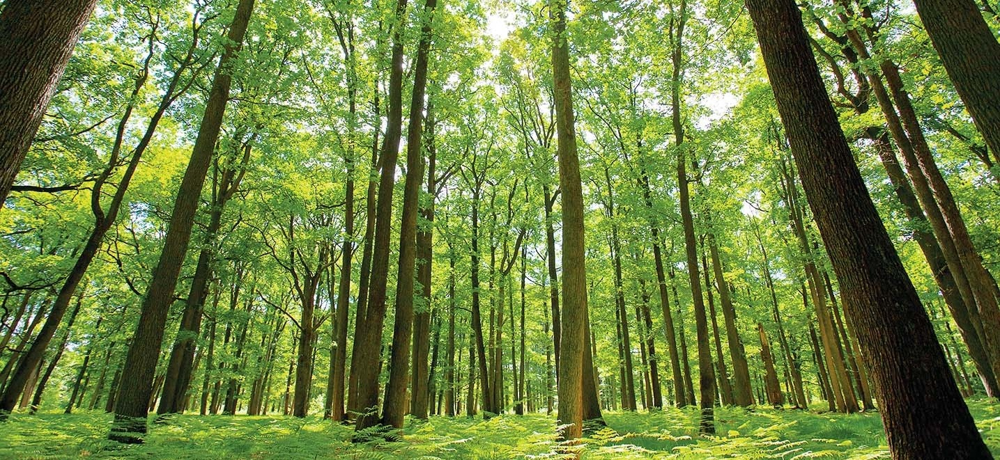

# scratchToRFR 🌲🌲🌲

***To my beloved Random Forest Regressor:***

  *Ever since I laid eyes on you in a Machine Learning tutorial on YouTube, it was love at first sight.*
  
  *Since then, we have worked together for the better part of a year, creating things I could only dream of.*
  
  *From more complicated projects such as the RFR model in [Johorscrape](https://github.com/milkbottledude/woodlands-jb_tracker) 🚗, to more humble beginnings like my very first Kaggle contest, for which I trained a Sklearn RFR model to predict Titanic survivors 🚢.*
  
  *However, despite all this time we have spent together, I haven't put in the effort to know you very well. I feel the need to understand you on a deeper level 👩‍❤️‍👨.*
  
  *So in this new project I'm embarking on, I'll be creating you from scratch ⚒️.*
  
  *To turn things up a notch, I won't be using our trusty partner in crime, Python. Instead, I'm opting for Javascript 🟨, which I just started learning a week ago.* 
  
  *This will help me get some JS practice outside of Leetcode, as well as help me become less reliant on ol' Python.*
  
  *That reminds me, I should probably stop spouting nonsense and go back to writing actual code*
  
  *If you do read this, I hope you will join me on my [journey](https://github.com/milkbottledude/scratchToRFR/blob/main/Documentation.md), where I fall in love with you all over again 💚*
  
  *.*

  *Sincerely,*
  
*milkbottledude*
